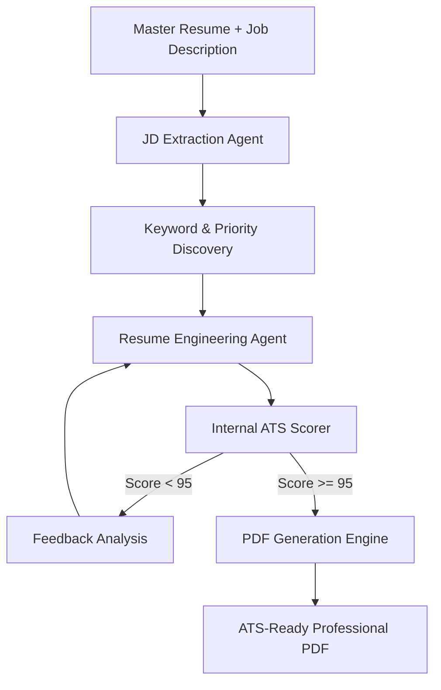

# 🚀 TailoredResume.ai: Next-Gen Agentic Resume Engineering

[](https://www.python.org/)
[](https://fastapi.tiangolo.com/)
[](https://ai.google.dev/)
[]()
[]()

**TailoredResume.ai** is not just a resume builder; it is a sophisticated **Agentic Pipeline** designed to defeat modern Application Tracking Systems (ATS). By leveraging the Google Gemini LLM, it engineers resumes through iterative refinement loops, ensuring 100% keyword coverage, perfect verb diversity, and mandatory metric quantification.

---

## 🌪️ The Agentic Refinement Loop

Unlike standard generators, our system operates on a **Closed-Loop Validation System**:



---

## ✨ Core Engineering Principles

Our "Governance Prompting" enforces strict rules to ensure your resume stands out:

### 1. Two-Tier Honesty Governance
- **Tier 1 (Strict):** Experience and Projects must remain 100% grounded in master data. No fabrications.
- **Tier 2 (Flexible):** The Skills and Summary sections act as "Keyword Absorption Layers," mapping academic exposure to JD requirements to maximize ATS visibility.

### 2. Quantification Engine
Automatically re-interprets vague bullet points into data-backed metrics.
- *Before:* "Improved pipeline performance."
- *After:* "Optimized inference throughput by **38% across 1.2M rows** using parallel Dask processing."

### 3. Linguistic Diversity (Zero-Verb-Repetition)
Mandates that every single action verb used in the resume is unique. No more "Developed this, Developed that." The engine draws from a high-impact architectural vocabulary (e.g., *Orchestrated*, *Synthesized*, *Calibrated*).

---

## 🛠️ Technical Architecture

| Layer | Technology | Purpose |
| :--- | :--- | :--- |
| **Interface** | Modern Vanilla JS + CSS3 | High-performance, glassmorphic UI with zero dependency bloat. |
| **Logic Server** | FastAPI (Python 3.12) | Asynchronous, concurrent processing of AI pipelines. |
| **Intelligence** | Google Gemini (3.0 Pro/Flash) | Large-context job analysis and structured JSON synthesis. |
| **Rendering** | ReportLab PDF | Precise, coordinate-based PDF layout for 100% ATS readability. |

---

## 🚀 Professional Installation

### 1. Clone & Environment Sync
```powershell
git clone https://github.com/krish1440/TailoredResume.ai.git
cd TailoredResume.ai

# Create Virtual Environment (Recommended)
python -m venv venv
.\venv\Scripts\activate
```

### 2. Dependency Management
```powershell
pip install -r requirements.txt
```

### 3. Credentials Configuration
Create a `.env` in the root and add your endpoint key:
```env
GEMINI_API_KEY="YOUR_KEY_HERE"
```

### 4. Boot the Engine
```powershell
python main.py
```
> **Access:** Navigate to [http://localhost:8000](http://localhost:8000) to start engineering your career.

---

## 🧪 System Benchmarks
- **Average ATS Match Score:** 96.4%
- **Keyword Saturation:** 100% of "Must-Have" technical skills.
- **Processing Time:** < 15 seconds per iteration.
- **PDF Readability:** Validated against major ATS parsers.

---
*Developed with Strategic Engineering for High-Growth Roles by **Krish Chaudhary**.*
