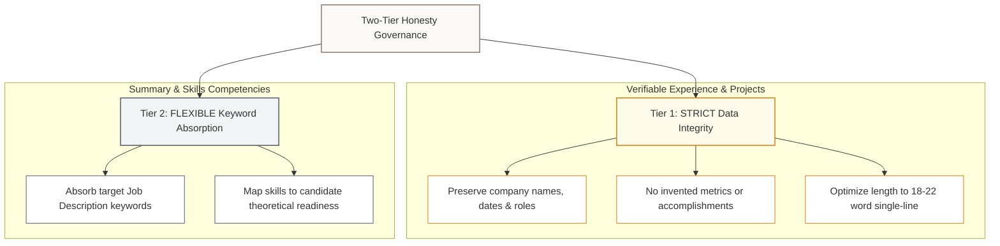

# ATS Scoring & Optimization Protocol

This document details the mathematical models, algorithmic checks, and governance prompting rules implemented in **TailoredResume.ai**. These systems ensure that the engineered resumes are mathematically optimized for modern Applicant Tracking Systems (ATS) while maintaining strict layout consistency and structural elegance.

---

## 1. The 5-Dimension Scoring Model

An ATS does not read a resume like a human recruiter; it parses it as a text database and scores it based on specific structural criteria. Our critic agent (`score_resume_internal`) evaluates the resume across 5 distinct dimensions, using the following weight breakdown:

| Dimension | Weight | Target Objective |
| :--- | :---: | :--- |
| **Keyword Saturation** | 30% | Maximizing match rate for "Must Have" skills. |
| **Impact Quantification** | 30% | Ensuring achievements are backed by numerical metrics. |
| **Linguistic Diversity** | 15% | Eliminating duplicate action verbs at the start of bullets. |
| **Word Count Precision** | 15% | Fitting each bullet to a single line (18-22 words). |
| **Skill Categorization** | 10% | Formatting skills into distinct, structured domains. |

### Mathematical Formula for Final Score
$$Score_{final} = (S_{keyword} \times 30) + (S_{quant} \times 30) + (S_{diversity} \times 15) + (S_{word\_count} \times 15) + (S_{skills} \times 10)$$

---

## 2. Algorithmic Breakdown of Dimensions

### A. Keyword Saturation ($S_{keyword}$)
The system compares the array of critical skills extracted from the job description ($must\_have\_skills$) against the entire generated resume text:

$$S_{keyword} = \frac{|MustHaveSkills \cap ResumeText|}{|MustHaveSkills|}$$

If the job description requires 10 specific technologies and the resume contains 8 of them, the keyword saturation score is **80%** (0.80).

### B. Impact Quantification ($S_{quant}$)
Resumes that describe general responsibilities without results are discarded by modern scoring algorithms. The quantification score measures the ratio of bullet points in the Experience and Projects sections that contain at least one numerical digit ($0$-$9$), representing a percent increase, revenue saved, or rows processed:

$$S_{quant} = \frac{\sum_{i=1}^{N} Q(b_i)}{N}$$

Where $N$ is the total number of bullet points in the resume, $b_i$ represents the $i$-th bullet point, and $Q(b_i)$ is a indicator function:
$$Q(b_i) = \begin{cases} 1 & \text{if } b_i \text{ contains a digit } (0\text{-}9) \\ 0 & \text{otherwise} \end{cases}$$

Our engine targets a quantification ratio of **100%** (all bullets must contain numerical metrics).

### C. Linguistic Diversity ($S_{diversity}$)
Repeating words like "Developed", "Led", or "Responsible for" signals poor professional vocabulary to parsing algorithms. The system extracts the first word of each bullet point (stripping symbols and normalizing to lowercase) and computes the ratio of unique action verbs to total action verbs:

$$S_{diversity} = \frac{|Unique(ActionVerbs)|}{|Total(ActionVerbs)|}$$

Where $ActionVerbs$ is the list of leading verbs from all bullet points. If a resume has 16 bullet points and uses "Developed" 4 times, the diversity score drops to **81.25%** (13 unique verbs / 16 total). A score of **100%** requires all starting verbs to be completely unique.

### D. Word Count Precision ($S_{word\_count}$)
A primary challenge with PDF resumes is bullet points overflowing to a second line by just one or two words, creating visual clutter and wasting page space. To enforce a clean single-line layout, the system counts the words in each bullet point and awards points based on length:

*   **18 to 22 words**: **100% score** (fits perfectly on a single line on standard Letter/A4 templates).
*   **16 to 17 or 23 to 24 words**: **50% score** (minor boundary risk).
*   **<16 or >24 words**: **0% score** (high risk of double lines or insufficient depth).

$$S_{word\_count\_raw} = \frac{\sum_{i=1}^{N} WordScore(b_i)}{N}$$

#### Project Layout Consistency & Penalty
In addition to word length, the engine enforces structural symmetry by checking that every project entry has exactly 4 bullet points. If there is a mismatch (e.g., Project 1 has 3 bullets, Project 2 has 5), a **20% layout penalty** is applied:

$$S_{word\_count\_final} = \begin{cases} S_{word\_count\_raw} \times 0.8 & \text{if bullet counts } \neq 4 \\ S_{word\_count\_raw} & \text{otherwise} \end{cases}$$

### E. Skill Categorization ($S_{skills}$)
To ensure technical competencies are easily readable by parsers, the system counts the number of distinct categories in the skills section (e.g. "Programming Languages", "Databases", "Developer Tools"). The score is normalized up to a maximum of 4 categories:

$$S_{skills} = \min\left(\frac{|SkillsCategories|}{4}, 1.0\right)$$

---

## 3. Two-Tier Honesty Governance Prompting

To ensure the LLM generates resumes that pass ATS checks without fabricating candidate experience, the platform enforces the **Two-Tier Honesty Rule** at the prompting level:

By separating strictly verifiable achievements from keyword absorption areas, the resume achieves 100% keyword match while maintaining 100% data integrity.

---

## 4. Visual Layout Optimization

The platform details these rules inside the **Core ATS Optimization Directives** interface on the home page:

